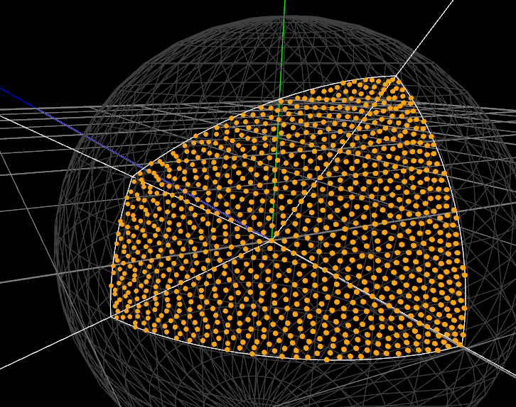
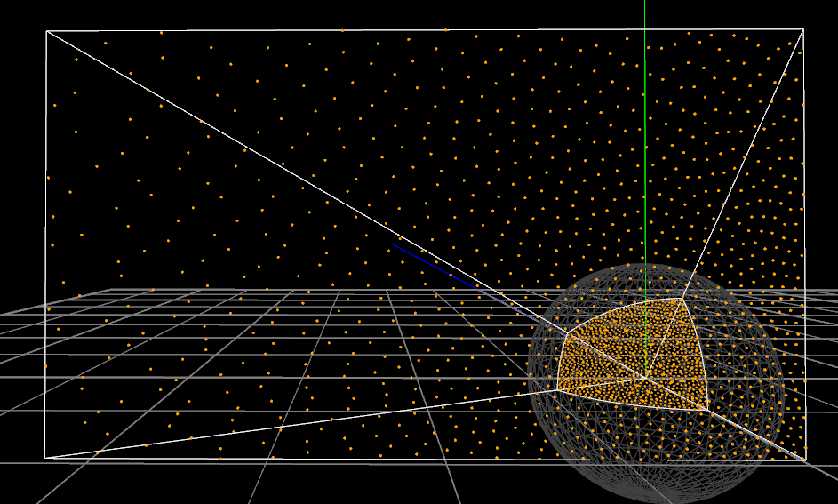

## An Area-Preserving Parametrization for Spherical Rectangles Demo
Carlos Ureña, Marcos Fajardo, Alan King , “An Area-Preserving Parametrization for Spherical Rectangles”

## demo

## dependencies
[openframeworks 0.10.0](https://openframeworks.cc/ja/)

[ofxImGuiLite](https://github.com/Ushio/ofxImGuiLite)

## bluenoise data
from Result 1 (eps)  
http://www.geometry.caltech.edu/BlueNoise/pointsets.html

## TEST
main.cpp has RUN_TEST Macro for simple test